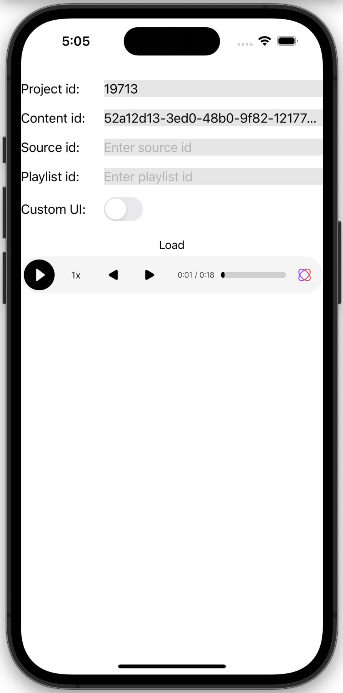

## Getting Started

The first step is to [create an account](https://dash.beyondwords.io/auth/signup)
and generate some content.

### Add the dependency to your Podfile

```podspec
target 'MyApp' do
  pod 'BeyondWordsPlayer'
end
```

*As an alternative you can also use the XCFramework attached to the assets of the latest [GitHub Release](https://github.com/beyondwords-io/player-ios/releases/)*

### Add PlayerView to your view hierarchy:

```Swift
let playerView = PlayerView()
playerViewParent.addSubview(playerView)
```

### Load your content into the player

```Swift
playerView.load(PlayerSettings(
    projectId: <ID>,
    contentId: <ID>
))
```

You will need to replace the `<ID>` placeholders with the real identifiers for
your project and content.

After running the app, the player should load:


## How it works

The PlayerView uses a WKWebView under the hood to load the [Web Player](https://github.com/BeyondWords-io/player) 
and provides a Swift interface which binds to the underlying JavaScript API.

You can check the API compatibility between the iOS and the Web player in the [compatibility.md](./compatibility.md)

To understand how the underlying Web Player works, please refer to its [documentation](https://github.com/beyondwords-io/player/blob/main/doc/getting-started.md#how-it-works).

## How to configure it

The preferred way to configure the player is by logging into the BeyondWords
dashboard, going to the Player tab, and changing its settings.

However, you can also override properties at the app level, for example:

```Swift
playerView.load(PlayerSettings(
    projectId: <ID>,
    contentId: <ID>,
    playerStyle: "large",
    callToAction: "Listen to this recipe",
    backgroundColor: "yellow",
))
```

These settings will take precedence over those specified in the dashboard and
allow more flexibility.

These settings can also be changed **after** loading the player, for example:

```Swift
playerView.setPlayerStyle("large")
playerView.setBackgroundColor("yellow")
playerView.setPlaybackRate(1.5F)
```

You can also refer to [example app](../Example) which showcases the core functionality of the player, including how to build a custom UI.


